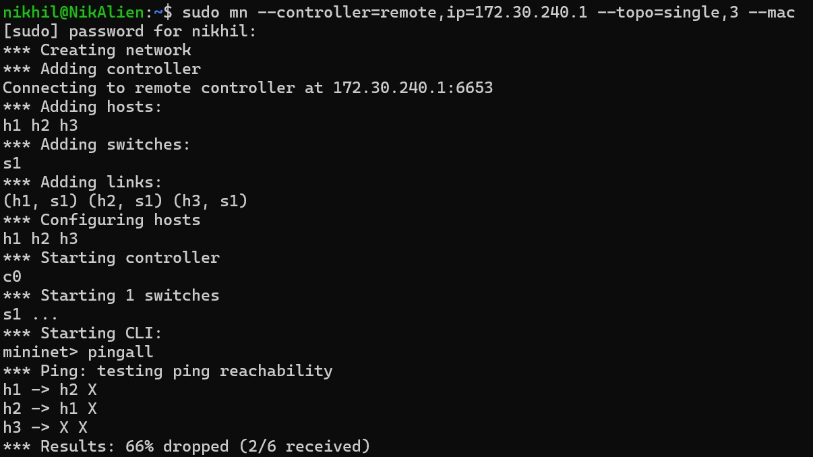
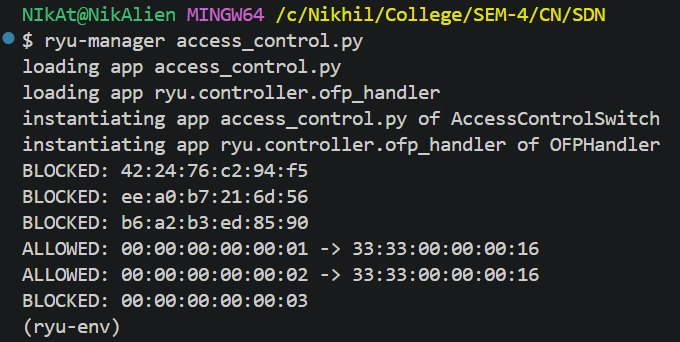

# SDN-Based Access Control System

## Overview

This project implements an SDN-based access control system using the Ryu
controller and Mininet. It allows only authorized hosts to communicate
within the network using a whitelist approach.

## Features

-   Maintain whitelist of allowed MAC addresses
-   Install allow/deny flow rules dynamically
-   Block unauthorized hosts
-   Verify access control via Mininet testing
-   Regression testing through repeated runs

## Screenshots

### Mininet Output



### Ryu Controller Logs



## How to Run

1.  Start Ryu Controller:

```{=html}
<!-- -->
```
    ryu-manager access_control.py

2.  Run Mininet:

```{=html}
<!-- -->
```
    sudo mn --controller=remote,ip=<controller-ip> --topo=single,3 --mac

3.  Test:

```{=html}
<!-- -->
```
    pingall

## Results

-   Authorized hosts can communicate
-   Unauthorized hosts are blocked
-   Logs clearly show ALLOWED / BLOCKED decisions
